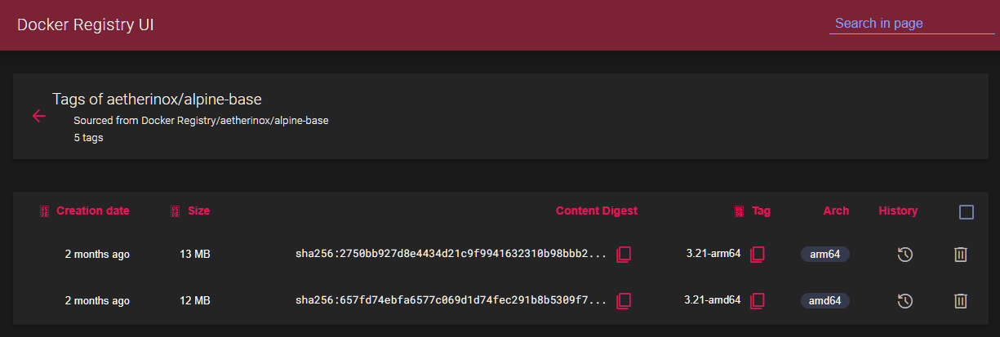
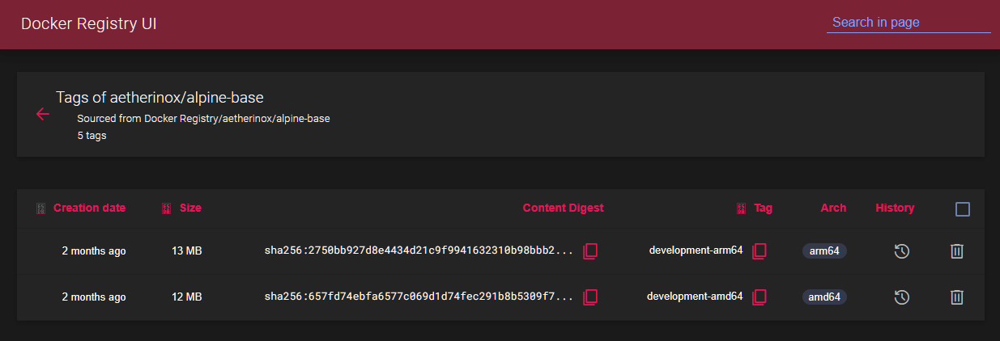
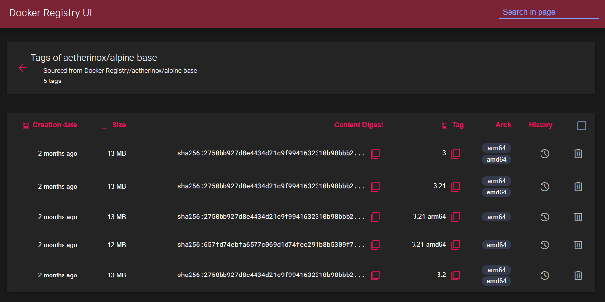
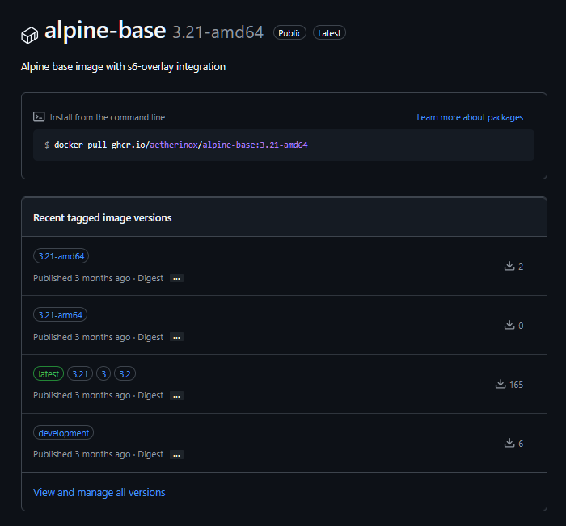
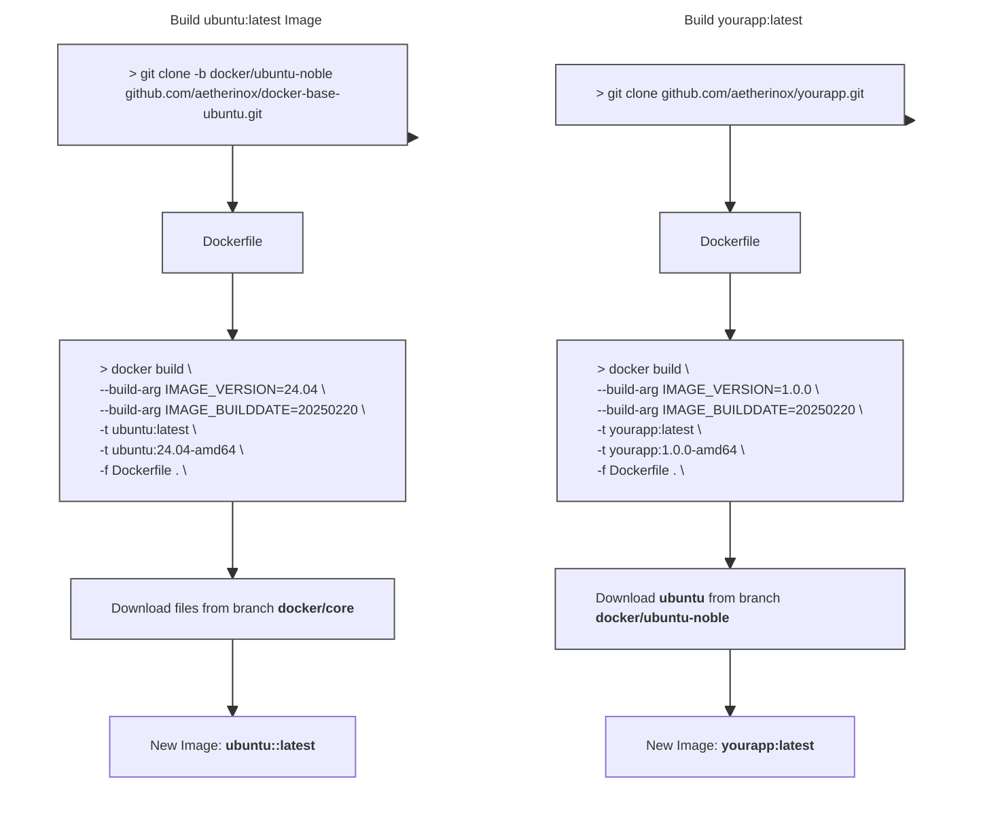

<div align="center">
<h6>Docker Image using Ubuntu and s6-overlay</h6>
<h1>💿 Base Image - Ubuntu 💿</h1>

<br />

This branch `docker/ubuntu-*` contains the base docker Ubuntu image which is utilized as a base for creating other images. This Ubuntu image is what you will derive your app's Dockerfile from.

Normal users should not need to modify the files in this repository.
 
</p>

<br />


<br />
<br />

<!-- prettier-ignore-start -->
[![Version][dockerhub-version-img]][dockerhub-version-uri]
[![Dockerhub Pulls][dockerhub-pulls-img]][dockerhub-pulls-uri]
[![Github Pulls][github-pulls-img]][github-pulls-uri]
[![Size][github-size-img]][github-size-img]
[![Last Commit][github-commit-img]][github-commit-img]
[![Contributors][contribs-all-img]](#contributors-)
<!-- prettier-ignore-end -->

</div>

<br />

---

<br />

- [About](#about)
  - [Features](#features)
  - [S6 Overlay](#s6-overlay)
  - [Read First](#read-first)
- [Building Image](#building-image)
  - [Before Building](#before-building)
    - [LF over CRLF](#lf-over-crlf)
    - [Set `+x / 0755` Permissions](#set-x--0755-permissions)
    - [Building Different Architectures](#building-different-architectures)
  - [Integrated Helper Scripts](#integrated-helper-scripts)
    - [`📄 utils.fix.sh`](#-utilsfixsh)
    - [`📄 utils.build.sh`](#-utilsbuildsh)
  - [Build Images](#build-images)
    - [Build Single Architecture](#build-single-architecture)
      - [amd64](#amd64)
      - [arm64](#arm64)
    - [Build All Architectures \& Manifest](#build-all-architectures--manifest)
      - [Stable - amd64](#stable---amd64)
      - [Stable - arm64](#stable---arm64)
      - [Development - amd64](#development---amd64)
      - [Development - arm64](#development---arm64)
- [Using Image](#using-image)
- [Extra Notes](#extra-notes)
  - [Accessing Container Shell](#accessing-container-shell)
    - [ash](#ash)
    - [sh](#sh)
    - [bash](#bash)
  - [Starting An App](#starting-an-app)
    - [Add Node.js](#add-nodejs)
    - [Configuring S6 Overlay](#configuring-s6-overlay)
    - [Preparing the directories](#preparing-the-directories)
    - [Delete Old Cached Files](#delete-old-cached-files)
    - [Download Base File](#download-base-file)
    - [Start App](#start-app)
    - [Terminate App](#terminate-app)
    - [Remove Unprocessed Files for the “File Processor” App](#remove-unprocessed-files-for-the-file-processor-app)
    - [Run Services](#run-services)
    - [Editing Dockerfile](#editing-dockerfile)
  - [PID 1 or Leave](#pid-1-or-leave)
  - [Custom Services](#custom-services)
  - [Custom Docker Image Scripts](#custom-docker-image-scripts)
  - [SSL Certificates](#ssl-certificates)
  - [Logs](#logs)


<br />

---

<br />

## About

The files contained within this branch [🔆 docker/ubuntu-noble](https://github.com/aetherinox/docker-base-ubuntu/tree/docker/ubuntu-noble) are utilized as a foundation. This base image only provides us with a docker image which has Ubuntu linux, Nginx, a few critical packages, and the **[s6-overlay](https://github.com/just-containers/s6-overlay)** plugin.

This branch [🔆 docker/ubuntu-noble](https://github.com/aetherinox/docker-base-ubuntu/tree/docker/ubuntu-noble) does **NOT** contain any applications. It is only to be used as a base image which will be called when you build your main app's `📄 Dockerfile`.

<br />
<br />

### Features

This docker image includes the following features:

* Simple init process which allows the end-user to execute tasks like initialization (`cont-init.d`),
finalization (`cont-finish.d`) and their own services with dependencies between them
* s6-overlay integration provides proper `PID 1` functionality
  * You'll never have zombie processes hanging around in your container, they are properly managed and cleaned up.
* Multiple processes in a single container
* Distributed as a small number of .tar.xz files depending on what exact functionality you need - to keep your image's number of layers small.
* A whole set of utilities included in `s6` and `s6-portable-utils`. Includes handy and composable utilities which make life much easier.
* Log rotating out-of-the-box through `logutil-service` which uses [`s6-log`](https://skarnet.org/software/s6/s6-log.html) under the hood.
* Support for Docker's `USER` directive, to run your whole process tree as a specific user.

<br />
<br />

### S6 Overlay

The S6 Overlay is called at the start of the container lifecycle as the first process, `PID 1`. After some minor internal setup, it will run the services you declare, and once the services end or the container is signaled to terminate, it will run your ending scripts.

All services can be `longrun` , `oneshot` or `bundle`, and are declared inside `etc/s6-overlay/s6-rc` with a descriptive name. The service definition is documented here, and [explained in detail over there](https://skarnet.org/software/s6/servicedir.html). In short, you use a bunch of empty files.

By S6 Overlay instructions, a service to create directores qualifies as a **oneshot**: it does something and then exits when it’s done. You have to define the type as oneshot, and include the `📄 up` file that points to the script or service to execute. The `📄 down` file, which is optional, can be used if the up script ends execution.

<br />
<br />

### Read First

To build a docker image using this base and the actual app you want to release, you need two different docker images:

- **Step 1**: Build **[🔆 docker/ubuntu-noble](https://github.com/aetherinox/docker-base-ubuntu/tree/docker/ubuntu-noble)** image **(this repo)**
  - When being built, the Ubuntu `📄 Dockerfile` will grab and install the files from the branch **[docker/core](https://github.com/aetherinox/docker-base-ubuntu/tree/docker/core)**
- **Step 2**: Build your app's docker image that will run on top of this Ubuntu image
- **Step 3**: Release the docker image built from **Step 2** to Github's **Ghcr.io** or **hub.docker.com**

<br />

> [!WARNING]
> You should NOT need to modify any of the files within this branch [🔆 docker/ubuntu-noble](https://github.com/aetherinox/docker-base-ubuntu/tree/docker/ubuntu-noble) unless you absolutely know what you are doing.

<br />

When you build this **[🔆 docker/ubuntu-noble](https://github.com/aetherinox/docker-base-ubuntu/tree/docker/ubuntu-noble)** image, the `📄 Dockerfile` will request files from another branch we host, which is the **[docker/core](https://github.com/aetherinox/docker-base-ubuntu/tree/docker/core)** branch.

```bash
ADD --chmod=755 "https://raw.githubusercontent.com/aetherinox/docker-base-ubuntu/docker/core/docker-images.${MODS_VERSION}" "/docker-images"
ADD --chmod=755 "https://raw.githubusercontent.com/aetherinox/docker-base-ubuntu/docker/core/package-install.${PKG_INST_VERSION}" "/etc/s6-overlay/s6-rc.d/init-mods-package-install/run"
ADD --chmod=755 "https://raw.githubusercontent.com/Aetherinox}/docker-base-ubuntu/docker/core/aetherxown.${AETHERXOWN_VERSION}" "/usr/bin/aetherxown"
ADD --chmod=755 "https://raw.githubusercontent.com/aetherinox/docker-base-ubuntu/docker/core/with-contenv.${WITHCONTENV_VERSION}" "/usr/bin/with-contenv"
```

<br />

`aetherxown` is vital and must be included in the base image you build. It is what controls the **USER : GROUP** permissions that will be handled within your docker image. 

For this reason, there are a few requirements you can read about below in the section **[Before Building](#before-building)**.

<br />

---

<br >

## Building Image

These instructions outline how the Ubuntu docker image is set up, and how to build your own docker image.

<br />

### Before Building

Prior to building the docker image, you **must** ensure the sections below are completed.

- [LF over CRLF](#lf-over-crlf)
- [Set +x / 0755 Permissions](#set-x--0755-permissions)
- [Building Different Architectures](#building-different-architectures)

<br />

You must ensure when you build this docker image [🔆 docker/ubuntu-noble](https://github.com/aetherinox/docker-base-ubuntu/tree/docker/ubuntu-noble), the following conditions must be met. 

<br />

If the listed tasks above are not performed, your docker container will throw the following errors when started:

- `Failed to open apk database: Permission denied`
- `s6-rc: warning: unable to start service init-adduser: command exited 127`
- `unable to exec /etc/s6-overlay/s6-rc.d/init-envfile/run: Permission denied`
- `/etc/s6-overlay/s6-rc.d/init-adduser/run: line 34: aetherxown: command not found`
- `/etc/s6-overlay/s6-rc.d/init-adduser/run: /usr/bin/aetherxown: cannot execute: required file not found`

<br />
<br />

#### LF over CRLF

Line endings in text files are marked using special control characters:
- **CR**: _Carriage Return_
  - 0x0D or decimal `13`
- **LF**: _Line Feed_
  - 0x0A or decimal `10`

<br />

Different operating systems use different conventions for line breaks:
- **Windows** uses a `CR/LF` sequence to indicate the end of a line
  - `\r\n`
- **Unix/Linux** and modern `macOS > v10.0` uses only `LF`
  - `\n`
- **Classic** `macOS < v10.0` used only `CR`
  - `\r`

<br />

If you attempt to build your Ubuntu docker image on Linux, and have windows CRLF in your files; you will get errors and the container will be unable to start. All files must be converted to Unix' `Line Feed`.  This can be done with **[Visual Studio Code](https://code.visualstudio.com/)**. OR; you can run the Linux terminal command `🗔 dos2unix` to convert these files.

<br />

> [!NOTE]
> You no longer need to manually run these commands. We have provided a script to run these commands automatically. See the section:
> - [📄 Integrated Helper Script](#integrated-helper-scripts)

<br />

For the branches [🔆 docker/ubuntu-noble](https://github.com/aetherinox/docker-base-ubuntu/tree/docker/ubuntu-noble) and your main app image, you can use the following recursive commands:

<br />

> [!CAUTION]
> Be careful using the command to change **ALL** files. You should **NOT** change the files in your `📁 .git` folder, otherwise you will corrupt your git indexes.
>
> If you accidentally run `🗔 dos2unix` on your `📁 .git` folder, do NOT push anything to git. Pull a new copy from the repo or reset your local files back to the remote:
> 
> ```shell
> git reset --hard origin/main
> ```

<br />

```shell
# Change ALL files
find ./ -type f | grep -Ev 'docs|node_modules|.git|*.jpg|*.jpeg|*.png' | xargs dos2unix --

# Change run / binaries
find ./ -type f -name 'run' -print | xargs dos2unix --
```

<br />

For the branch **[docker/core](https://github.com/aetherinox/docker-base-ubuntu/tree/docker/core)**, you can use the following commands:

```shell
dos2unix docker-images.v3
dos2unix aetherxown.v1
dos2unix package-install.v1
dos2unix with-contenv.v1
```

<br />

You may pre-check if a file is using Windows CRLF or Linux LF by running the command `file <filename>` on the file:

```shell
$ file ./root//etc/s6-overlay/s6-rc.d/ci-service-check/type
./root//etc/s6-overlay/s6-rc.d/ci-service-check/type: ASCII text
```

<br />

You will get one of three messages listed below:

1. ASCII text, with `CRLF, LF` line terminators
2. ASCII text, with `CRLF` line terminators
3. ASCII text

<br />

If you get messages `1` or `2`, then you need to run `dos2unix` on the file; otherwise when you bring the container up, you will get errors.

<br />
<br />

#### Set `+x / 0755` Permissions

The files contained within this repo **MUST** have `chmod 755` /  `+x` executable permissions. If you are using our Github workflow sample **[deploy-docker-github.yml](https://github.com/aetherinox/docker-base-ubuntu/blob/workflows/samples/deploy-docker-github.yml)**, this is done automatically. If you are building the images manually; you need to do this. Ensure those files have the correct permissions prior to building the Ubuntu base docker image.

If you are building the [🔆 docker/ubuntu-noble](https://github.com/aetherinox/docker-base-ubuntu/tree/docker/ubuntu-noble) or your main application images, you must ensure the files in those branches have the proper permissions. All of the executable files are named `run`:

<br />

> [!NOTE]
> You no longer need to manually run these commands. We have provided a script to run these commands automatically. See the section:
> - [📄 Integrated Helper Script](#integrated-helper-scripts)

<br />

To fix the permissions, `cd` into the folder where your Ubuntu base image files are and run the command:

```shell
find ./ -name 'run' -print -exec sudo chmod +x {} \;
```

<br />

<sub><sup>Optional - </sup></sub> If you want to set the permissions manually, run the following below. If you executed the `find` command above, you don't need to run the list of commands below:

```shell
sudo chmod +x ./root/etc/s6-overlay/s6-rc.d/init-adduser/run \
  ./root/etc/s6-overlay/s6-rc.d/init-crontab-config/run \
  ./root/etc/s6-overlay/s6-rc.d/init-custom-files/run \
  ./root/etc/s6-overlay/s6-rc.d/init-envfile/run \
  ./root/etc/s6-overlay/s6-rc.d/init-folders/run \
  ./root/etc/s6-overlay/s6-rc.d/init-keygen/run \
  ./root/etc/s6-overlay/s6-rc.d/init-migrations/run \
  ./root/etc/s6-overlay/s6-rc.d/init-permissions/run \
  ./root/etc/s6-overlay/s6-rc.d/init-samples/run \
  ./root/etc/s6-overlay/s6-rc.d/init-version-checks/run \
  ./root/etc/s6-overlay/s6-rc.d/svc-cron/run \
  ./root/etc/s6-overlay/s6-rc.d/svc-php-fpm/run \
  ./root/etc/s6-overlay/s6-rc.d/svc-nginx/run \
  ./root/etc/s6-overlay/s6-rc.d/init-php/run \
  ./root/etc/s6-overlay/s6-rc.d/init-nginx/run
```

<br />

For the branch **[docker/core](https://github.com/aetherinox/docker-base-ubuntu/tree/docker/core)**, there are a few files to change. The ending version number may change, but the commands to change the permissions are as follows:

```shell
sudo chmod +x docker-images.v3 \
  chmod +x aetherxown.v1 \
  chmod +x package-install.v1 \
  chmod +x with-contenv.v1
```

<br />
<br />

#### Building Different Architectures

Out-of-box, you cannot build an image for a different architecture than your system. If you are running **amd64**, and want to build the arm64 image; you must install `QEMU` as a docker container by running the command:

```shell
docker run --privileged --rm tonistiigi/binfmt --install all
```

<br />

Once you have the above docker container running, you can now run the `docker buildx` command as normal:

```shell
# Build Ubuntu arm64
docker buildx build \
  --build-arg IMAGE_NAME=ubuntu \
  --build-arg IMAGE_DISTRO=noble \
  --build-arg IMAGE_ARCH=arm64 \
  --build-arg IMAGE_BUILDDATE=20260812 \
  --build-arg IMAGE_VERSION=24.04 \
  --build-arg IMAGE_RELEASE=stable \
  --build-arg IMAGE_REGISTRY=github \
  --tag ghcr.io/aetherinox/ubuntu:latest \
  --tag ghcr.io/aetherinox/ubuntu:24.04 \
  --tag ghcr.io/aetherinox/ubuntu:noble \
  --tag ghcr.io/aetherinox/ubuntu:noble-YYYYMMDD \
  --tag ghcr.io/aetherinox/ubuntu:noble-arm64 \
  --attest type=sbom,disabled=true \
  --output type=docker \
  --builder default \
  --file Dockerfile \
  --platform linux/arm64 \
  --allow network.host \
  --network host \
  --no-cache \
  --push \
  .
```

<br />

Make sure you change the following arguments over to `arm64`:

- `--build-arg IMAGE_ARCH=arm64 \`
- `--platform linux/arm64 \`


<br />
<br />

### Integrated Helper Scripts

This feature became available with Ubuntu v24.04. The [🔆 docker/ubuntu-noble](https://github.com/aetherinox/docker-base-ubuntu/tree/docker/core) branch of this repository includes two new scripts:

- `📄 utils.fix.sh`
  - Ensures that your local copy of this Ubuntu repository has the correct permissions; including the `+x` executable flag on all `run` files.
- `📄 utils.build.sh`
  - Builds the Ubuntu docker image from simply running the bash script.

<br />

To utilize these scripts, ensure you set the `+x` permission on the two scripts:

```shell
sudo chmod +x utils.fix.sh
sudo chmod +x utils.build.sh
```

<br />

Then run the scripts:

```shell
./utils.fix.sh
./utils.build.sh
```

<br />
<br />

#### `📄 utils.fix.sh`

The `fix permissions` script will ensure that your local copy of this Ubuntu repository has the proper permissions for all files before you create a docker image; or re-upload it to Github or your own registry. It will ensure that the `run` files have the `+x` execute permission. Without this permission; your container will fail when it starts up.

This script is automatically ran when you execute the `📄 utils.build.sh` script to build the container. You do not need to run this script before the build script.

<br />
<br />

#### `📄 utils.build.sh`

The build script allows you to build the [🔆 docker/ubuntu-noble](https://github.com/aetherinox/docker-base-ubuntu/tree/docker/ubuntu-noble) image without having to manually execute the `docker buildx <...>` commands. It accepts a series of arguments compatible with docker so that you can customize how the image turns out.

After the permissions are set up; you can now run the scripts in any order, at any time. The build script `📄 utils.build.sh` will automatically run the bash script to fix permissions `📄 utils.fix.sh` before it starts to build your docker image, so you don't need to run it individually.

<br />
<br />

### Build Images

After completing the steps above; we will now build the Ubuntu image in the branch [🔆 docker/ubuntu-noble](https://github.com/aetherinox/docker-base-ubuntu/tree/docker/ubuntu-noble).

<br />

This docker image contains numerous arguments you can pass which determine what versions of Ubuntu and leaf dependencies will be installed.

```dockerfile
ARG IMAGE_REPO_AUTHOR="aetherinox"
ARG IMAGE_REPO_NAME="docker-base-ubuntu"
ARG IMAGE_NAME="ubuntu"
ARG IMAGE_DISTRO="noble"
ARG IMAGE_ARCH="amd64"
ARG IMAGE_SHA1="0000000000000000000000000000000000000000"
ARG IMAGE_REGISTRY="local"
ARG IMAGE_RELEASE="stable"
ARG IMAGE_BUILDDATE="20250101"
ARG IMAGE_VERSION="24.04"
```

<br />

> [!NOTE]
> The `IMAGE_ARCH` argument supports two options; which you will specify by using the argument `--build-arg IMAGE_ARCH=amd64` in your buildx command:
> 
> - `amd64`
> - `arm64`

<br />

Next, select which type of image you want to build below.

- [Build Single Architecture](#build-single-architecture)
- [Build All Architectures & Manifest](#build-all-architectures--manifest)

<br />
<br />

#### Build Single Architecture

All of the needed Docker files already exist in the repository. To get started, clone the repo to a folder

```shell
mkdir docker-ubuntu && cd docker-ubuntu

# to clone from our github website
git clone https://github.com/aetherinox/docker-base-ubuntu.git --branch docker/ubuntu-noble .
```

<br />

If you do not need to build both `amd64` and `arm64`, you can simply build one architecture. First, create a new buildx container:

```shell
docker buildx create --driver docker-container --name container --bootstrap --use
```

<br />

> [!NOTE]
> **Optional:**
> If you first need to remove the provider container because you created it previously, run the command:
>
> ```shell
> docker buildx rm container
> docker buildx create --driver docker-container --name container --bootstrap --use
> ```

<br />

To list all buildx build containers, run:

```shell
docker buildx ls
```

<br />

Before you can push the image, ensure you are signed into Docker CLI. Open your Linux terminal and see if you are already signed in:

```shell
docker info | grep Username
```

<br />

If nothing is printed; then you are not signed in. Initiate the web login:

```shell
docker login
```

<br />

Some text will appear on-screen, copy the code, open your browser, and go to https://login.docker.com/activate

```console
USING WEB BASED LOGIN
To sign in with credentials on the command line, use 'docker login -u <username>'

Your one-time device confirmation code is: XXXX-XXXX
Press ENTER to open your browser or submit your device code here: https://login.docker.com/activate

Waiting for authentication in the browser…
```

<br />

Once finished in your browser, return to your Linux terminal, and it should bring you back to where you can type a command. You can now verify again if you are signed in:

```shell
docker info | grep Username
```

<br />

You should see your name:

```console
 Username: aetherinox
```

<br />

You are ready to build the Ubuntu docker image, run the command for your platform:

<br />

##### amd64

Creates the Ubuntu `amd64` docker image:

```shell
# Build ubuntu amd64
docker buildx build \
  --build-arg IMAGE_NAME=ubuntu \
  --build-arg IMAGE_DISTRO=noble \
  --build-arg IMAGE_ARCH=amd64 \
  --build-arg IMAGE_BUILDDATE=20260812 \
  --build-arg IMAGE_VERSION=24.04 \
  --build-arg IMAGE_RELEASE=stable \
  --build-arg IMAGE_REGISTRY=github \
  --tag ghcr.io/aetherinox/ubuntu:latest \
  --tag ghcr.io/aetherinox/ubuntu:24.04 \
  --tag ghcr.io/aetherinox/ubuntu:noble \
  --tag ghcr.io/aetherinox/ubuntu:noble-YYYYMMDD \
  --tag ghcr.io/aetherinox/ubuntu:noble-amd64 \
  --attest type=provenance,disabled=true \
  --attest type=sbom,disabled=true \
  --output type=docker \
  --builder default \
  --file Dockerfile \
  --platform linux/amd64 \
  --allow network.host \
  --network host \
  --no-cache \
  --push \
  .
```

<br />

##### arm64

Creates the Ubuntu `arm64` docker image:

```shell
# Build ubuntu arm64
docker buildx build \
  --build-arg IMAGE_NAME=ubuntu \
  --build-arg IMAGE_DISTRO=noble \
  --build-arg IMAGE_ARCH=arm64 \
  --build-arg IMAGE_BUILDDATE=20260812 \
  --build-arg IMAGE_VERSION=24.04 \
  --build-arg IMAGE_RELEASE=stable \
  --build-arg IMAGE_REGISTRY=github \
  --tag ghcr.io/aetherinox/ubuntu:latest \
  --tag ghcr.io/aetherinox/ubuntu:24.04 \
  --tag ghcr.io/aetherinox/ubuntu:noble \
  --tag ghcr.io/aetherinox/ubuntu:noble-YYYYMMDD \
  --tag ghcr.io/aetherinox/ubuntu:noble-arm64 \
  --attest type=provenance,disabled=true \
  --attest type=sbom,disabled=true \
  --output type=docker \
  --builder default \
  --file Dockerfile \
  --platform linux/arm64 \
  --allow network.host \
  --network host \
  --no-cache \
  --push \
  .
```

<br />

> [!NOTE]
> If you want to only build the Ubuntu docker image locally; remove `--push`.

<br />

After building the image, you can now use the image either with `🗔 docker run` or a `📄 docker-compose.yml` file. These instructions are available by skipping down to the sections:

- [🗔 Docker Run](#docker-run-1)
- [📄 Docker Compose](#docker-compose-1)

<br />
<br />

#### Build All Architectures & Manifest

These instructions tell you how to build the `stable` and `development` releases for both the `amd64` and `arm64` architectures. Then you will combine all manifests into one release.

All of the needed Docker files already exist in the repository. To get started, clone the repo to a folder

```shell
mkdir docker-ubuntu && cd docker-ubuntu

# to clone from our github website
git clone https://github.com/aetherinox/docker-base-ubuntu.git --branch docker/ubuntu-noble .
```

<br />

First, create a new buildx container:

```shell
docker buildx create --driver docker-container --name container --bootstrap --use
```

<br />

> [!NOTE]
> **Optional:**
> If you first need to remove the provider container because you created it previously, run the command:
>
> ```shell
> docker buildx rm container
> docker buildx create --driver docker-container --name container --bootstrap --use
> ```

<br />

To list all buildx build containers, run:

```shell
docker buildx ls
```

<br />

Before you can push the image, ensure you are signed into Docker CLI. Open your Linux terminal and see if you are already signed in:

```shell
docker info | grep Username
```

<br />

If nothing is printed; then you are not signed in. Initiate the web login:

```shell
docker login
```

<br />

Some text will appear on-screen, copy the code, open your browser, and go to https://login.docker.com/activate

```console
USING WEB BASED LOGIN
To sign in with credentials on the command line, use 'docker login -u <username>'

Your one-time device confirmation code is: XXXX-XXXX
Press ENTER to open your browser or submit your device code here: https://login.docker.com/activate

Waiting for authentication in the browser…
```

<br />

Once you are finished in your browser, you can return to your Linux terminal, and it should bring you back to where you can type a command. You can now verify again if you are signed in:

```shell
docker info | grep Username
```

<br />

You should see your name:

```console
 Username: aetherinox
```

<br />

Next, in order to build the `amd64` and `arm64` images on the same machine; you must install **QEMU** which is an emulator. Open your terminal and run the following command:

```shell
docker run --privileged --rm tonistiigi/binfmt --install all
```

<br />

If you are building these docker images using Github workflow, you will also need to use `QEMU` with the following action:

```yml
            - name: '⚙️ Set up QEMU'
              id: task_release_gh_qemu
              uses: docker/setup-qemu-action@v3
```

<br />

Once the emulator is installed; we will now build two images. When building these two images; we will ensure the `--tag` value is different for each one, by adding the architecture to the end. This ensures we don't overwrite one image with the newer one. We need to have two seperate docker images with two different tags.

- `--tag ghcr.io/aetherinox/ubuntu:noble-amd64`
- `--tag ghcr.io/aetherinox/ubuntu:noble-arm64`

<br />

> [!NOTE]
> The build commands below will push the docker image to Github's GHCR registry. If you wish to use another registry, edit the **--tag**:
>
> The `--tag <registry>` argument is what determines what registry your image will be pushed to. You can change this to any registry:
> 
> | Registry | Tag |
> | --- | --- |
> | Dockerhub | `--tag aetherinox/ubuntu:noble-amd64`<br>`--tag aetherinox/ubuntu:noble-arm64` |
> | Github (GHCR) | `--tag ghcr.io/aetherinox/ubuntu:noble-amd64`<br>`--tag ghcr.io/aetherinox/ubuntu:noble-arm64` |
> | Registry v2 | `--tag registry.domain.lan/aetherinox/ubuntu:noble-amd64`<br>`--tag registry.domain.lan/aetherinox/ubuntu:noble-arm64` |
> | Gitea | `--tag git.domain.lan/aetherinox/ubuntu:noble-amd64`<br>`--tag git.domain.lan/aetherinox/ubuntu:noble-arm64` |

<br />

After we build these two images and push them to a registry online; merge them into a single docker image which contains both arcitectures.

<br />

> [!WARNING]
> In order to merge the two architecture images into one; you **MUST** `--push` each of the two docker images to a registry first. You cannot modify the manifests locally.

<br />

##### Stable - amd64

Creates the Ubuntu **Stable** release `amd64` docker image:

```shell
# Build ubuntu amd64 - (stable release)
docker buildx build \
  --build-arg IMAGE_NAME=ubuntu \
  --build-arg IMAGE_DISTRO=noble \
  --build-arg IMAGE_ARCH=amd64 \
  --build-arg IMAGE_BUILDDATE=20260812 \
  --build-arg IMAGE_VERSION=24.04 \
  --build-arg IMAGE_RELEASE=stable \
  --build-arg IMAGE_REGISTRY=github \
  --tag ghcr.io/aetherinox/ubuntu:noble-amd64 \
  --attest type=provenance,disabled=true \
  --attest type=sbom,disabled=true \
  --output type=docker \
  --builder default \
  --file Dockerfile \
  --platform linux/amd64 \
  --allow network.host \
  --network host \
  --no-cache \
  --pull \
  --push \
  .
```

<br />

##### Stable - arm64

Creates the Ubuntu **Stable** release `arm64` docker image:

```shell
# Build ubuntu arm64 - (stable release)
docker buildx build \
  --build-arg IMAGE_NAME=ubuntu \
  --build-arg IMAGE_DISTRO=noble \
  --build-arg IMAGE_ARCH=arm64 \
  --build-arg IMAGE_BUILDDATE=20260812 \
  --build-arg IMAGE_VERSION=24.04 \
  --build-arg IMAGE_RELEASE=stable \
  --build-arg IMAGE_REGISTRY=github \
  --tag ghcr.io/aetherinox/ubuntu:noble-arm64 \
  --attest type=provenance,disabled=true \
  --attest type=sbom,disabled=true \
  --output type=docker \
  --builder default \
  --file Dockerfile \
  --platform linux/arm64 \
  --allow network.host \
  --network host \
  --no-cache \
  --pull \
  --push \
  .
```

<br />

##### Development - amd64

Creates the Ubuntu **Development** release `amd64` docker image:

```shell
# Build ubuntu amd64 - (development release)
docker buildx build \
  --build-arg IMAGE_NAME=ubuntu \
  --build-arg IMAGE_DISTRO=noble \
  --build-arg IMAGE_ARCH=amd64 \
  --build-arg IMAGE_BUILDDATE=20260812 \
  --build-arg IMAGE_VERSION=24.04 \
  --build-arg IMAGE_RELEASE=development \
  --build-arg IMAGE_REGISTRY=github \
  --tag ghcr.io/aetherinox/ubuntu:noble-development-amd64 \
  --attest type=provenance,disabled=true \
  --attest type=sbom,disabled=true \
  --output type=docker \
  --builder default \
  --file Dockerfile \
  --platform linux/amd64 \
  --allow network.host \
  --network host \
  --no-cache \
  --pull \
  --push \
  .
```

<br />

##### Development - arm64

Creates the Ubuntu **Development** release `arm64` docker image:

```shell
# Build ubuntu arm64 - (development release)
docker buildx build \
  --build-arg IMAGE_NAME=ubuntu \
  --build-arg IMAGE_DISTRO=noble \
  --build-arg IMAGE_ARCH=arm64 \
  --build-arg IMAGE_BUILDDATE=20260812 \
  --build-arg IMAGE_VERSION=24.04 \
  --build-arg IMAGE_RELEASE=development \
  --build-arg IMAGE_REGISTRY=github \
  --tag ghcr.io/aetherinox/ubuntu:noble-development-arm64 \
  --attest type=provenance,disabled=true \
  --attest type=sbom,disabled=true \
  --output type=docker \
  --builder default \
  --file Dockerfile \
  --platform linux/arm64 \
  --allow network.host \
  --network host \
  --no-cache \
  --pull \
  --push \
  .
```

<br />

After completing the `docker buildx` commands above; you should now have a few new images. Each image should have its own separate docker tags which do not conflict. If you decided to not build the **development** releases below; that is fine.

<br />

- `--tag ghcr.io/aetherinox/ubuntu:noble-amd64`
- `--tag ghcr.io/aetherinox/ubuntu:noble-arm64`
- `--tag ghcr.io/aetherinox/ubuntu:noble-development-amd64`
- `--tag ghcr.io/aetherinox/ubuntu:noble-development-arm64`

<br />

Next, we need to take these two images, and merge them into one so that both architectures are available without having to push separate images. You need to obtain the SHA256 hash digest for the `amd64` and `arm64` images. You can go to the registry where you uploaded the images and then copy them. Or you can run the commands specified below depending on which release type you want:

<br />
<br />

**Stable Release**

If you are building the **stable release** images; you should see the following:

<br />

<p align="center"><br><sub><sup><b>Registry v2:</b> Newly created <code>amd64</code> and <code>arm64</code> images</sup></sub></p>

<br />

You can also get the hash digests by running the commands:

```shell
$ docker buildx imagetools inspect ghcr.io/aetherinox/ubuntu:noble-amd64

Name:      ghcr.io/aetherinox/ubuntu:noble-amd64
MediaType: application/vnd.docker.distribution.manifest.v2+json
Digest:    sha256:657fd74ebfa6577c069d1d74fec291b8b5309f762e7ad2d0d14b51de64a841b8

$ docker buildx imagetools inspect ghcr.io/aetherinox/ubuntu:noble-arm64

Name:      ghcr.io/aetherinox/ubuntu:noble-arm64
MediaType: application/vnd.docker.distribution.manifest.v2+json
Digest:    sha256:2750bb927d8e4434d21c9f9941632310b98bbb2729389af236888ebbc4d75dda
```

<br />
<br />

**Development Release**

If you are building the **development release** images; you should see the following:

<br />

<p align="center"><br><sub><sup><b>Registry v2:</b> Newly created <code>noble-development-amd64</code> and <code>noble-development-arm64</code> images</sup></sub></p>

<br />

You can also get the hash digests by running the commands:

<br />

```shell
$ docker buildx imagetools inspect ghcr.io/aetherinox/ubuntu:noble-development-amd64

Name:      ghcr.io/aetherinox/ubuntu:noble-development-amd64
MediaType: application/vnd.docker.distribution.manifest.v2+json
Digest:    sha256:8f36385a28c8f6eb7394d903c9a7a2765b06f94266b32628389ee9e3e3d7e69d

$ docker buildx imagetools inspect ghcr.io/aetherinox/ubuntu:noble-development-arm64

Name:      ghcr.io/aetherinox/ubuntu:noble-development-arm64
MediaType: application/vnd.docker.distribution.manifest.v2+json
Digest:    sha256:c719ccb034946e3f0625003f25026d001768794e38a1ba8aafc9146291d548c5
```

<br />
<br />

> [!WARNING]
> **Wrong Digest Hashes**
> 
> Be warned that when you push docker images to your docker registry; the `SHA256` hash digest will be different than what you have locally. If you use the following command; these digests will be **incorrect**:
> 
> ```shell
> $ docker images --all --no-trunc | grep aetherinox
> 
> ghcr.io/aetherinox/ubuntu   noble-arm64        sha256:bb425429e98ab467fd91474701da2e5c0a7cb4a5f218a710d950eb0ff595486c   3 minutes ago   38.8MB
> 
> ghcr.io/aetherinox/ubuntu   noble-amd64        sha256:dea4cb91379dba289d8d3e8842d4fb7b7857faa7f3d02d5b9a043a1ee58e61d7   4 minutes ago   27.3MB
> ```
>
> To get the correct sha256 digest, use:
> - `docker buildx imagetools inspect ghcr.io/aetherinox/ubuntu:noble-amd64`
> - `docker buildx imagetools inspect ghcr.io/aetherinox/ubuntu:noble-arm64`
> - `docker buildx imagetools inspect ghcr.io/aetherinox/ubuntu:noble-development-amd64`
> - `docker buildx imagetools inspect ghcr.io/aetherinox/ubuntu:noble-development-arm64`
> 

<br />
<br />

Once you have the correct `SHA256` hash digests; paste them into the command below. This command is where you can specify the real `--tag` that the public image will have. The previous tags were simply placeholders and no longer matter.

<br />

For the **stable** releases, use:

```shell
# #
#    Image > Stable
# #

docker buildx imagetools create \
  --tag ghcr.io/aetherinox/ubuntu:latest \
  --tag ghcr.io/aetherinox/ubuntu:24.04 \
  --tag ghcr.io/aetherinox/ubuntu:noble \
  --tag ghcr.io/aetherinox/ubuntu:noble-YYYYMMDD \

  sha256:657fd74ebfa6577c069d1d74fec291b8b5309f762e7ad2d0d14b51de64a841b8 \
  sha256:2750bb927d8e4434d21c9f9941632310b98bbb2729389af236888ebbc4d75dda

[+] Building 0.2s (4/4) FINISHED                                                                                                                                                                                                      
 => [internal] pushing ghcr.io/aetherinox/ubuntu:latest               0.2s
 => [internal] pushing ghcr.io/aetherinox/ubuntu:24.04                0.2s
 => [internal] pushing ghcr.io/aetherinox/ubuntu:noble                0.2s
 => [internal] pushing ghcr.io/aetherinox/ubuntu:noble-YYYYMMDD       0.2s
```

<br />

For the **development** releases, use:

```shell
# #
#    Image > Development
# #

docker buildx imagetools create \
  --tag ghcr.io/aetherinox/ubuntu:noble-development \
  sha256:2750bb927d8e4434d21c9f9941632310b98bbb2729389af236888ebbc4d75dda \
  sha256:657fd74ebfa6577c069d1d74fec291b8b5309f762e7ad2d0d14b51de64a841b8

[+] Building 0.1s (1/1) FINISHED
 => [internal] pushing ghcr.io/aetherinox/ubuntu:noble-development   0.1s
```

<br />

> [!NOTE]
> Compared to the **stable** release which has 4 tags; the **development** release only has one tag.

<br />

Alternatively, you could use the `🗔 manifest create` command; as an example, you can merge multiple architecture images together into a single image. The top line with `🔖 aetherinox/ubuntu:latest` can be any name. However, all images after `--amend` MUST be already existing images uploaded to the registry.

```shell
docker manifest create ghcr.io/aetherinox/ubuntu:latest \
    --amend ghcr.io/aetherinox/ubuntu:latest-amd64 \
    --amend ghcr.io/aetherinox/ubuntu:latest-arm32v7 \
    --amend ghcr.io/aetherinox/ubuntu:latest-arm64v8

docker manifest push ghcr.io/aetherinox/ubuntu:latest
```

<br />

In this example, we take the existing two files we created earlier, and merge them into one. You can either specify the image by `SHA256 digest`, or tag:

```shell
# Example 1 (using tag)
docker manifest create ghcr.io/aetherinox/ubuntu:latest \
    --amend ghcr.io/aetherinox/ubuntu:noble-amd64 \
    --amend ghcr.io/aetherinox/ubuntu:noble-arm64

# Example 2 (using sha256 hash)
docker manifest create ghcr.io/aetherinox/ubuntu:latest \
    --amend ghcr.io/aetherinox/ubuntu@sha256:657fd74ebfa6577c069d1d74fec291b8b5309f762e7ad2d0d14b51de64a841b8 \
    --amend ghcr.io/aetherinox/ubuntu@sha256:2750bb927d8e4434d21c9f9941632310b98bbb2729389af236888ebbc4d75dda

# Push manifest changes to registry
docker manifest push ghcr.io/aetherinox/ubuntu:latest
```

<br />

If you go back to your registry; you should now see multiple new entries, all with different tags. Two of the images are your old `amd64` and `arm64` images, and then you should have your official one with the four tags specified above. You can delete the two original images if you do not want them.

<p align="center"><br><sub><sup><b>Registry v2:</b> Newly created <code>amd64</code> and <code>arm64</code> images, and merged containers with both architectures</sup></sub></p>

<br />
<br />

If you are pushing to Github's GHCR; the interface will look different, as Github merges all tags into a single listing, instead of Registry v2 listing each tag on its own:

<p align="center"><br><sub><sup><b>Registry v2:</b> Newly created <code>amd64</code> and <code>arm64</code> images, and merged containers with both architectures</sup></sub></p>

<br />

The flow of the process is outlined below:



<br />

Once the base Ubuntu image is built, you can now use it to build the actual docker version of your app.

<br />

---

<br />

## Using Image

To use your new docker Ubuntu base image, you simply need to reference it in your project's `📄 Dockerfile`. Open your app's `📄 Dockerfile`, and add:

```dockerfile
ARG IMAGE_ARCH=amd64
ARG IMAGE_VERSION=24.04
FROM --platform=linux/${IMAGE_ARCH} ghcr.io/aetherinox/ubuntu:${IMAGE_VERSION}
```

<br />

In the Dockerfile code above, you will see that we are pulling from `ghcr.io/aetherinox/ubuntu:${IMAGE_VERSION}`; where `${IMAGE_VERSION}` gets replaced with the version of Ubuntu we wish to use. At the time of writing this, it is `24.04`.

<br />

After you reference the Ubuntu image, you can then write the remaining parts of your project's Dockerfile. Once you are ready to build, then build the image, and the Ubuntu base you created an image for earlier will be used as the foundation for whatever project you lay over top of it.

<br />

---

<br />

## Extra Notes

The following are other things to take into consideration when creating the [🔆 docker/ubuntu-noble](https://github.com/aetherinox/docker-base-ubuntu/tree/docker/ubuntu-noble) and your app docker image that will use this base image:

<br />

### Accessing Container Shell

Any project docker image built using this base image contains Ubuntu Linux, but also includes the `📦 bash` package. Use one of the following to access the shell for this container:

<br />

#### ash

```shell
docker exec -it base-ubuntu-noble ash
```

<br />

#### sh

```shell
docker exec -it base-ubuntu-noble sh
```

<br />

#### bash

```shell
docker exec -it base-ubuntu-noble bash
```

<br />
<br />

### Starting An App

This section explains how to set up a basic set of services with s6-overlay:

<br />

#### Add Node.js

Our example app will depend on Node.JS — “Node” from now on — we need to install it in our container. While Ubuntu includes APT as the package manager, it doesn’t includes Node in its repositories.

Open your project's `Dockerfile` and add the following lines:

```shell
# #
#    Set Node.JS version as the latest stable ("current")
# #

ENV NODE_VERSION="current"

# #
#    Install and update Ubuntu tools.
# #

RUN \
    apk add --no-cache \
        ca-certificates \
        curl \
        bash \
        nodejs \
        npm \
        gnupg \
        gpg
```

<br />

> [!NOTE]
> If you’re using another interpreter like Python or PHP, you may need to check their installation procedure, as these depend on the container and architecture.

<br />

#### Configuring S6 Overlay

The S6 Overlay will be called at the start of the container lifecycle as the first process, PID 1. After some minor internal setup, it will run the services you declare, and once the services end or the container is signaled to terminate, it will run your ending scripts.

We don’t need to wait for all prior steps to end before launching the Node apps, and that’s the flexibility of the new S6 Overlay v3. We can tell to the overlay which services depends on which.

All services can be:
- longrun
- oneshot
- bundle

<br />

These options are declared inside `etc/s6-overlay/s6-rc` with a descriptive name. The service definition is [documented here](https://skarnet.org/software/s6-rc/s6-rc-compile.html), and [explained in detail here](https://skarnet.org/software/s6/servicedir.html). In short, you use a bunch of empty files.

Before doing anything, we will create a directory with the S6 Overlay configuration that we will copy into our image later.

<br />

#### Preparing the directories

By S6 Overlay instructions, a service to create directores qualifies as a **oneshot**: it does something and then exits when it’s done. You have to define the type as oneshot, and include the `📄 up` file that points to the script or service to execute. The `📄 down` file, which is optional, can be used if the up script ends execution.

First, declare the service as a oneshot inside a file called type .

```shell
echo "oneshot" >| etc/s6-overlay/s6-rc.d/prepare-directories/type
```

<br />

Next, add the `📄 up` file. This file must have only **one line** as an UNIX command because it’s parsed by `🗔 execlineb`, which, contrary to shell utilities like `🗔 bash` or `🗔 sh`, it replaces itself with the called process. In our case, it will call bash which in turn will run a script that handles all of the directories preparation.

<br />

```shell
echo "bash run.sh" >| etc/s6-overlay/s6-rc.d/prepare-directories/up
```

After that, the only thing left is to create our script inside the same directory as `📄 run.sh`, and here we will also fix some permissions and ownership that are required for these directories to properly work.

```bash
#!/bin/bash

# #
#    create folders
# #

mkdir -p /var/www/myapp/{cache,storage}
mkdir -p /var/www/fileapp/storage/

# #
#    modify ownership as inheritable
# #

chmod g+s /var/www/myapp/
chmod g+s /var/www/fileapp/

# #
#    make the folders writable by user `www-data`; which is used by the app processes
# #

chmod g+w /var/www/myapp/{cache,storage}
chmod g+w /var/www/fileapp/storag
```

<br />

#### Delete Old Cached Files

Next, we need to delete our old cache. This step is relatively easy. We only need to remove all files in the cache file. Since it’s another `oneshot` service, we have to make the same steps as before:

```shell
echo "oneshot" >| etc/s6-overlay/s6-rc.d/delete-cache/type
```

```shell
echo "bash run.sh" >| etc/s6-overlay/s6-rc.d/delete-cache/up
```

<br />

And in our `📄 run.sh`, add the commands necessary to delete the cached files, if there is any.

```shell
#!/bin/bash

rm -r /var/www/myapp/cache/*
```

<br />

The problem with this command if simple: What happens if the directory doesn’t exists? How we can be sure the directories are prepared before executing this step? That’s where dependencies come in, to ensure a command runs after another.

Dependencies in S6 Overlay can be defined in the `📁 dependencies.d` directory, each of them as an empty file with the name of the service it depends on. We can add one or many, it doesn’t matter.

```shell
mkdir -p etc/s6-overlay/s6-rc.d/delete-cache/dependencies.d

touch etc/s6-overlay/s6-rc.d/delete-cache/dependencies.d/prepare-directories
```

<br />

S6 Overlay will automatically check if these dependencies have run successfully, and just then run the service. We don’t need to make any of these checks by ourselves.

<br />

#### Download Base File

Next, same as before, create a `oneshot` service and add the script that will handle the download.

```shell
echo "oneshot" >| etc/s6-overlay/s6-rc.d/download-base/type
```

<br />

We can simply call a Node script that will handle the download of the base file.

```shell
echo "npm --prefix /var/www/fileapp run download" >| etc/s6-overlay/s6-rc.d/download-base/up
```

<br />

This command depends on the prepared directories, so as the previous command, we will need to add it as a dependency, otherwise it will run as soon as it can.

```shell
mkdir -p etc/s6-overlay/s6-rc.d/download-base/dependencies.d

touch etc/s6-overlay/s6-rc.d/download-base/dependencies.d/prepare-directories
```

<br />

#### Start App

Running an app in your docker container **not** a `oneshot`, but a `long-lasting` process that will only exit because of an unrecoverable state or because the container has been told so and it requires to hear the termination signal from S6 Overlay. In that case, we have to set it as `longrun`.

Create a new folder with a `📄 type` file:

```shell
echo "longrun" >| etc/s6-overlay/s6-rc.d/start-myapp/type
```

<br />

To run our app, we need to call the NPM script called `production`. It’s the same as with the step prior.

```shell
echo "npm --prefix /var/www/myapp run production" >| etc/s6-overlay/s6-rc.d/start-myapp/up
```

<br />

Next, we need to set the dependencies for this service. We can’t run the app until the cache is cleared, because the app has to regenerate these files so that changes are re-compiled properly. Creating a `📄 delete-cache` was explained in the previous section [Delete Old Cached Files](#delete-old-cached-files).

Create a `📁 dependencies.d` folder, and then create a new file named `📄 dependencies.d/delete-cache`

```shell
mkdir -p etc/s6-overlay/s6-rc.d/start-myapp/dependencies.d

touch etc/s6-overlay/s6-rc.d/start-myapp/dependencies.d/delete-cache
```

<br />

Once you have this done, you can now configure it to start your app. The app is also classified as a `long-running` service, since it constantly checks if a new file has to be processed, and saves the results somewhere. Just as before, set it as `longrun` and add the command to start the application. Create the file `📄 type` if you don't have it already, and then add the code to the file:

```shell
touch etc/s6-overlay/s6-rc.d/start-fileapp/type
echo "longrun" >| etc/s6-overlay/s6-rc.d/start-fileapp/type
```

<br />

Next, create the `📄 up` file if you don't already have it, and add a command to that file:

```shell
touch etc/s6-overlay/s6-rc.d/start-fileapp/up
echo "npm --prefix /var/www/fileapp run production" >| etc/s6-overlay/s6-rc.d/start-fileapp/up
```

<br />

This process depends on our app, without it; there will be no files to process. It also depends on the base file that is downloaded. S6 Overlay will attempt to smartly resolve the dependency chain of both dependencies.

```shell
mkdir -p etc/s6-overlay/s6-rc.d/start-fileapp/dependencies.d

touch etc/s6-overlay/s6-rc.d/start-fileapp/dependencies.d/download-base \
      etc/s6-overlay/s6-rc.d/start-fileapp/dependencies.d/start-myapp
```

<br />

#### Terminate App

Our app has to terminate gracefully. Luckily for us, there is nothing to “undo” when the app is shut down.

<br />
<br />

#### Remove Unprocessed Files for the “File Processor” App

When the Files App terminates, any ongoing file processing is also terminated abruptly. That means that lingering trash will pile up, and unprocessed files will still be marked as “ongoing”.

This can be a problem; when the container starts again, the Files App will read the information about the incomplete files as “ongoing” and it won’t pick them up. Instead, we need to mark these as “pending” again.

First; we create a timeout to finish. It’s a file that indicates the milliseconds to wait for the service to terminate before being killed. We don’t want this service to hang indefinitely while being shut down, but also give time to end any file processing if it’s close to the finish line. This file is entirely optional.

Add 10,000 milliseconds (10 seconds):

```shell
touch etc/s6-overlay/s6-rc.d/start-fileapp/timeout-down
echo "10000" >| etc/s6-overlay/s6-rc.d/start-fileapp/timeout-down
```

<br />

Next, we need to add a script that will set in the database all ongoing processes that didn’t terminate to pending, which will signal the app to start their processing again once it starts. This unorphaning is done via an NPM script, so there is no need to pull out our hair on bash with database calls. We only need to create the `📄 finish` script file inside the service directory. First, create a new file:

```shell
touch etc/s6-overlay/s6-rc.d/start-fileapp/finish
```

<br />

Then add the following bash script:

```shell
#!/bin/sh

# #
#    This file is in `etc/s6-overlay/s6-rc.d/start-fileapp/finish`
# #

# #
#    Tell the FileApp to unorphan each file processing.
# #

npm --prefix /var/www/fileapp run unorphan

# #
#    If exit code is uncought, pass the second exit code received.
# #

if test "$1" -eq 256 ; then
    e=$((128 + $2))
else
    e="$1"
fi

# #
#    Pass exit code to S6 Overlay so we can know the exit code later.
# #

echo "$e" > /run/s6-linux-init-container-results/exitcode
```

<br />

Now we need to tell S6 Overlay to run these services.

<br />

#### Run Services

We have defined the services to run, put we haven’t told S6 Overlay to run them. Luckly, S6 Overlay offers a simple way handle this: by setting each of them inside the user service. S6 Overlay starts the built-in **user** service, which is a “bundle”, meaning, it’s considered a group of services. Each service declared inside starts automatically.

<br />

> [!NOTE]
> S6 Overlay also includes the base service which is another bundle that starts before the user. The latter is useful to avoid race conditions, as it guarantees that tasks run and end before the user service bundle.
> 
> The base bundle runs **first**, the user bundle runs **second**.

<br />

We need to add each service to the user bundle. The start order is defined by the dependencies of each, which is handled magically by S6 Overlay. For that, we can create empty files with the name of the services inside the `📁 user/contents.d` directory.

```shell
touch etc/s6-overlay/s6-rc.d/user/contents.d/prepare-directories \
      etc/s6-overlay/s6-rc.d/user/contents.d/delete-cache \
      etc/s6-overlay/s6-rc.d/user/contents.d/download-base \
      etc/s6-overlay/s6-rc.d/user/contents.d/start-myapp \
      etc/s6-overlay/s6-rc.d/user/contents.d/start-fileapp \
```

<br />

When S6 Overlay runs, these services will run in any order, but respecting their dependencies.

<br />

#### Editing Dockerfile

Go back to your project's Dockerfile, and you can now add the following instructions:

```dockerfile
# #
#    Set the user for this container
# #

USER www-data

# #
#    Set the myapp as the workdir
# #

WORKDIR /var/www/myapp

# #
#    Run the S6 Overlay INIT
# #

ENTRYPOINT ["/init"]

# #
#    Set the default command to be Node version.
# #

CMD ["node", "-v"]
```

<br />

### PID 1 or Leave

In the world of Linux, the Process Identifier 1 (`PID 1`) is considered the **master** process, and there is no other parent process than itself. If this process terminates, then the computer shuts down because is understood there is no more work to be done. S6 overlay launches within your docker container as PID 1. Once that app terminates, the docker container ceases to operate and it will throw a `FAILED` code.

<br />
<br />

### Custom Services

When creating your personal project's foundation, you can create a custom service which is ran once the docker image is brought up. Within your project's folder structure, create the following folder path:

```shell
mkdir -p /root/etc/services.d/yourapp/
```

<br />

Now create a new run file:

```shell
sudo touch /root/etc/services.d/yourapp/run
```

<br />

Open the newly created file and add your bash logic. The following is a very basic service script which finds our docker container IP addresses, assigns them to a variable, then installs a NPM project and then moved it to its final running path. You do not need to use this script, it is simply an example:

```bash
#!/usr/bin/with-contenv bash
# shellcheck shell=bash

# #
#   defaults
# #

PUID=${PUID:-911}
PGID=${PGID:-911}
DIR_BUILD=${DIR_BUILD:-/usr/src/app}
DIR_RUN=${DIR_RUN:-/usr/bin/app}

# #
#   define > colors
#
#   Use the color table at:
#       - https://gist.github.com/fnky/458719343aabd01cfb17a3a4f7296797
# #

declare -A c=(
    [end]=$'\e[0m'
    [white]=$'\e[97m'
    [bold]=$'\e[1m'
    [dim]=$'\e[2m'
    [underline]=$'\e[4m'
    [strike]=$'\e[9m'
    [blink]=$'\e[5m'
    [inverted]=$'\e[7m'
    [hidden]=$'\e[8m'
    [black]=$'\e[0;30m'
    [redl]=$'\e[0;91m'
    [redd]=$'\e[0;31m'
    [magental]=$'\e[0;95m'
    [magentad]=$'\e[0;35mm'
    [bluel]=$'\e[0;94m'
    [blued]=$'\e[0;34m'
    [cyanl]=$'\e[0;96m'
    [cyand]=$'\e[0;36m'
    [greenl]=$'\e[0;92m'
    [greend]=$'\e[0;32m'
    [yellowl]=$'\e[0;93m'
    [yellowd]=$'\e[0;33m'
    [greyl]=$'\e[0;37m'
    [greyd]=$'\e[0;90m'
    [navy]=$'\e[38;5;62m'
    [olive]=$'\e[38;5;144m'
    [peach]=$'\e[38;5;210m'
)

# #
#   unicode for emojis
#       https://apps.timwhitlock.info/emoji/tables/unicode
# #

declare -A icon=(
    ["symbolic link"]=$'\xF0\x9F\x94\x97' # 🔗
    ["regular file"]=$'\xF0\x9F\x93\x84' # 📄
    ["directory"]=$'\xF0\x9F\x93\x81' # 📁
    ["regular empty file"]=$'\xe2\xad\x95' # ⭕
    ["log"]=$'\xF0\x9F\x93\x9C' # 📜
    ["1"]=$'\xF0\x9F\x93\x9C' # 📜
    ["2"]=$'\xF0\x9F\x93\x9C' # 📜
    ["3"]=$'\xF0\x9F\x93\x9C' # 📜
    ["4"]=$'\xF0\x9F\x93\x9C' # 📜
    ["5"]=$'\xF0\x9F\x93\x9C' # 📜
    ["pem"]=$'\xF0\x9F\x94\x92' # 🔑
    ["pub"]=$'\xF0\x9F\x94\x91' # 🔒
    ["pfx"]=$'\xF0\x9F\x94\x92' # 🔑
    ["p12"]=$'\xF0\x9F\x94\x92' # 🔑
    ["key"]=$'\xF0\x9F\x94\x91' # 🔒
    ["crt"]=$'\xF0\x9F\xAA\xAA ' # 🪪
    ["gz"]=$'\xF0\x9F\x93\xA6' # 📦
    ["zip"]=$'\xF0\x9F\x93\xA6' # 📦
    ["gzip"]=$'\xF0\x9F\x93\xA6' # 📦
    ["deb"]=$'\xF0\x9F\x93\xA6' # 📦
    ["sh"]=$'\xF0\x9F\x97\x94' # 🗔
)

# #
#   define > system
# #

sys_os_ver="1.0.0"
sys_os_name="Unknown"

# #
#   s6 > store env variables
# #

printf '%-29s %-65s\n' "  ${c[bluel]}STATUS${c[end]}" "${c[end]}Fetching docker container and gateway addresses${c[end]}"

# #
#   get container ips
# #

ip_gateway=$(/sbin/ip route|awk '/default/ { print $3 }')
ip_container=$(ifconfig | grep -Eo 'inet (addr:)?([0-9]*\.){3}[0-9]*' | grep -Eo '([0-9]*\.){3}[0-9]*' | grep -v '127.0.0.1')

if [ -d "/var/run/s6/container_environment/" ]; then
    printf "$ip_gateway" > /var/run/s6/container_environment/IP_GATEWAY
    printf "$ip_container" > /var/run/s6/container_environment/IP_CONTAINER
else
    printf '%-29s %-65s\n' "  ${c[redl]}ERROR${c[end]}" "${c[end]}Cannot generate s6-overlay env files; folder ${c[redl]}/var/run/s6/container_environment/${c[end]} does not exist${c[end]}"
    bHasError=true
fi

# #
#   s6 > export env vars
# #

export IP_GATEWAY=$ip_gateway
export IP_GATEWAY=$ip_container

# #
#   install and startup for YourApp
# #

printf '%-29s %-65s\n' "  ${c[bluel]}STATUS${c[end]}" "${c[end]}Copying ${c[bluel]}${DIR_BUILD}${c[end]} to ${c[bluel]}${DIR_RUN}${c[end]}"
if [ -z "${DIR_BUILD}" ]; then
    printf '%-29s %-65s\n' "  ${c[redl]}ERROR${c[end]}" "${c[end]}Cannot copy; env var ${c[redl]}\${DIR_BUILD}${c[end]} missing${c[end]}"
    bHasError=true
else
    if [ -d "${DIR_BUILD}/" ]; then
        cp -r ${DIR_BUILD}/* ${DIR_RUN}
    else
        printf '%-29s %-65s\n' "  ${c[redl]}ERROR${c[end]}" "${c[end]}Cannot copy folder ${c[redl]}${DIR_BUILD}${c[end]} to ${c[redl]}${DIR_RUN}${c[end]}; build folder ${c[redl]}${DIR_BUILD}${c[end]} does not exist${c[end]}"
        bHasError=true
    fi
fi

# #
#   remove build directory
# #

printf '%-29s %-65s\n' "  ${c[bluel]}STATUS${c[end]}" "${c[end]}Remove ${c[bluel]}${DIR_BUILD}/${c[end]}"
if [ -z "${DIR_BUILD}" ]; then
    printf '%-29s %-65s\n' "  ${c[redl]}ERROR${c[end]}" "${c[end]}Cannot remove; env var ${c[redl]}\${DIR_BUILD}${c[end]} missing${c[end]}"
else
    if [ -d "${DIR_BUILD}" ]; then
        rm -rf "${DIR_BUILD}/"
    else
        printf '%-29s %-65s\n' "  ${c[redl]}ERROR${c[end]}" "${c[end]}Cannot remove; build folder ${c[redl]}${DIR_BUILD}${c[end]} does not exist. Restart the container to re-initialize build folder.${c[end]}"
    fi
fi

# #
#   cd to BUILD_RUN directory
# #

printf '%-29s %-65s\n' "  ${c[bluel]}STATUS${c[end]}" "${c[end]}Changing to run directory ${c[bluel]}${DIR_RUN}/${c[end]}"
if [ -z "${DIR_RUN}" ]; then
    printf '%-29s %-65s\n' "  ${c[redl]}ERROR${c[end]}" "${c[end]}Cannot cd; env var ${c[redl]}\${DIR_RUN}${c[end]} missing${c[end]}"
    bHasError=true
else
    if [ -d "${DIR_RUN}" ]; then
        cd ${DIR_RUN}
    else
        printf '%-29s %-65s\n' "  ${c[redl]}ERROR${c[end]}" "${c[end]}Cannot cd; run folder ${c[redl]}${DIR_RUN}${c[end]} does not exist${c[end]}"
        bHasError=true
    fi
fi

# #
#   install your app via npm
# #

printf '%-29s %-65s\n' "  ${c[bluel]}STATUS${c[end]}" "${c[end]}Running command ${c[bluel]}npm install --omit=dev${c[end]}"
if ! command -v npm; then
    printf '%-29s %-65s\n' "  ${c[redl]}ERROR${c[end]}" "${c[end]}Cannot install YourApp with npm because package ${c[redl]}npm${c[end]} not installed${c[end]}"
    bHasError=true
else
    npm install --omit=dev

    printf '%-29s %-65s\n' "  ${c[bluel]}STATUS${c[end]}" "${c[end]}Running command ${c[bluel]}npm start${c[end]}"
    npm start
fi

# #
#   finished run script
# #

printf '%-29s %-65s\n' "  ${c[greenl]}OK${c[end]}" "${c[end]}Finished initializing script${c[end]}"
if [ "$bHasError" = true ] ; then
    printf '%-29s %-65s\n' "" ""
    printf '%-29s %-65s\n' "  ${c[redl]}ERROR${c[end]}" "${c[end]}Fatal errors were detected${c[end]}"
    printf '%-29s %-65s\n' "  ${c[redl]}${c[end]}" "${c[end]}The run script detected that certain steps failed. This app may not${c[end]}"
    printf '%-29s %-65s\n' "  ${c[redl]}${c[end]}" "${c[end]}work properly. Try restarting the container.${c[end]}"
    printf '%-29s %-65s\n' "" ""
fi
```

<br />

Once you create this new service file, ensure the permissions are correct:

```shell
sudo chmod +x ./root/etc/services.d/yourapp/run
```

<br />

Finally, make sure you are using the proper carriages. You cannot utilize Windows' `Carriage Return Line Feed`. All files must be converted to Unix' `Line Feed`.

```shell
dos2unix ./root/etc/services.d/yourapp/run
```

<br />

When you start your project's docker image up, this service will be executed.

<br />
<br />

### Custom Docker Image Scripts

The [🔆 docker/ubuntu-noble](https://github.com/aetherinox/docker-base-ubuntu/tree/docker/ubuntu-noble) and any project docker images which use this Ubuntu base image, support the ability of adding custom scripts that will be ran when the container is started. To create / add a new custom script to the container, you need to create a new folder in the container source files `/root` folder

```shell
mkdir -p /root/custom-cont-init.d/
```

<br />

Within this new folder, add your custom script:

```shell
nano /root/custom-cont-init.d/my_customs_script
```

<br />

```bash
#!/bin/bash

echo "**** INSTALLING BASH ****"
apk add --no-cache bash
```

<br />

When you create the docker image, this new script will automatically be loaded. You can also do this via the `docker-compose.yml` file by mounting a new volume:

```yml
services:
    yourapp:
        volumes:
            - ./config:/config
            - ./app:/usr/bin/app
            - ./custom-scripts:/custom-cont-init.d:ro
```

<br />

> [!NOTE]
> if using compose, we recommend mounting them **read-only** (`:ro`) so that container processes cannot write to the location.

> [!WARNING]
> The folder `/root/custom-cont-init.d` **MUST** be owned by `root`. If this is not the case, this folder will be renamed and a new empty folder will be created. This is to prevent remote code execution by putting scripts in the aforesaid folder.

<br />

Your main app docker image can contain a custom script called `/root/custom-cont-init.d/plugins`. Do **NOT** edit this script. It is what automatically downloads the official application plugins and adds them to the container.

<br />
<br />

### SSL Certificates

This docker image automatically generates an SSL certificate when the nginx server is brought online. 

<br />

You may opt to either use the generated self-signed certificate, or you can add your own. If you decide to use your own self-signed certificate, ensure you have mounted the `/config` volume in your `docker-compose.yml`:

```yml
services:
    yourapp:
        container_name: yourapp
        image: ghcr.io/aetherinox/yourapp:latest                    # Image: Github
      # image: aetherinox/yourapp:latest                            # Image: Dockerhub
      # image: git.domain.lan/aetherinox/yourapp:latest             # Image: Gitea
      # image: yourapp:latest                                       # Image: Locally built
        restart: unless-stopped
        volumes:
            - ./config:/config
            - ./app:/usr/bin/app
```

<br />

Then navigate to the newly mounted folder and add your `📄 cert.crt` and `🔑 cert.key` files to the `📁 /yourapp/keys/*` folder.

<br />

> [!NOTE]
> If you are generating your own certificate and key, we recommend a minimum of:
> - RSA: `2048 bits`
> - ECC: `256 bits`
> - ECDSA: `P-384 or P-521`

<br />
<br />

### Logs

This base Ubuntu image contains detailed logs which will output what the docker container is currently doing. On top of built-in logs, the s6-overlay also has an env variable you can set to view logs for the container as it boots up. Modify your `🗔 docker run` command or in a `📄 docker-compose.yml` file; add the env variable `S6_VERBOSITY=5`

```yml
    base-ubuntu-noble:
        container_name: base-ubuntu-noble
        image: aetherinox/ubuntu:noble
        hostname: noble
        environment:
            - TZ=Etc/UTC
            - S6_VERBOSITY=2
```

<br />

You can pick a number between `1-5`; with `5` being the most verbose and will output every little thing that the container is doing. The default value is `S6_VERBOSITY=2`.

<br />

---

<br />

<!-- BADGE > GENERAL -->
  [general-npmjs-uri]: https://npmjs.com
  [general-nodejs-uri]: https://nodejs.org
  [general-npmtrends-uri]: http://npmtrends.com/Aetherinox

<!-- BADGE > IMAGE_VERSION > GITHUB -->
  [github-version-img]: https://img.shields.io/github/v/tag/aetherinox/docker-base-ubuntu?logo=GitHub&label=Version&color=ba5225
  [github-version-uri]: https://github.com/aetherinox/docker-base-ubuntu/releases

<!-- BADGE > IMAGE_VERSION > GITHUB (For the Badge) -->
  [github-version-ftb-img]: https://img.shields.io/github/v/tag/aetherinox/docker-base-ubuntu?style=for-the-badge&logo=github&logoColor=FFFFFF&logoSize=34&label=%20&color=ba5225
  [github-version-ftb-uri]: https://github.com/aetherinox/docker-base-ubuntu/releases

<!-- BADGE > IMAGE_VERSION > NPMJS -->
  [npm-version-img]: https://img.shields.io/npm/v/Aetherinox?logo=npm&label=Version&color=ba5225
  [npm-version-uri]: https://npmjs.com/package/Aetherinox

<!-- BADGE > IMAGE_VERSION > PYPI -->
  [pypi-version-img]: https://img.shields.io/pypi/v/Aetherinox
  [pypi-version-uri]: https://pypi.org/project/Aetherinox/

<!-- BADGE > LICENSE > MIT -->
  [license-mit-img]: https://img.shields.io/badge/MIT-FFF?logo=creativecommons&logoColor=FFFFFF&label=License&color=9d29a0
  [license-mit-uri]: https://github.com/aetherinox/docker-base-ubuntu/blob/main/LICENSE

<!-- BADGE > GITHUB > DOWNLOAD COUNT -->
  [github-downloads-img]: https://img.shields.io/github/downloads/aetherinox/docker-base-ubuntu/total?logo=github&logoColor=FFFFFF&label=Downloads&color=376892
  [github-downloads-uri]: https://github.com/aetherinox/docker-base-ubuntu/releases

<!-- BADGE > NPMJS > DOWNLOAD COUNT -->
  [npmjs-downloads-img]: https://img.shields.io/npm/dw/%40Aetherinox%2Fdocker-base-ubuntu?logo=npm&&label=Downloads&color=376892
  [npmjs-downloads-uri]: https://npmjs.com/package/Aetherinox

<!-- BADGE > GITHUB > DOWNLOAD SIZE -->
  [github-size-img]: https://img.shields.io/github/repo-size/aetherinox/docker-base-ubuntu?logo=github&label=Size&color=59702a
  [github-size-uri]: https://github.com/aetherinox/docker-base-ubuntu/releases

<!-- BADGE > NPMJS > DOWNLOAD SIZE -->
  [npmjs-size-img]: https://img.shields.io/npm/unpacked-size/Aetherinox/latest?logo=npm&label=Size&color=59702a
  [npmjs-size-uri]: https://npmjs.com/package/Aetherinox

<!-- BADGE > CODECOV > COVERAGE -->
  [codecov-coverage-img]: https://img.shields.io/codecov/c/github/aetherinox/docker-base-ubuntu?token=MPAVASGIOG&logo=codecov&logoColor=FFFFFF&label=Coverage&color=354b9e
  [codecov-coverage-uri]: https://codecov.io/github/aetherinox/docker-base-ubuntu

<!-- BADGE > ALL CONTRIBUTORS -->
  [contribs-all-img]: https://img.shields.io/github/all-contributors/aetherinox/docker-base-ubuntu?logo=contributorcovenant&color=de1f6f&label=contributors
  [contribs-all-uri]: https://github.com/all-contributors/all-contributors

<!-- BADGE > GITHUB > BUILD > NPM -->
  [github-build-img]: https://img.shields.io/github/actions/workflow/status/aetherinox/docker-base-ubuntu/deploy-docker.yml?logo=github&logoColor=FFFFFF&label=Build&color=%23278b30
  [github-build-uri]: https://github.com/aetherinox/docker-base-ubuntu/actions/workflows/deploy-docker.yml

<!-- BADGE > GITHUB > BUILD > Pypi -->
  [github-build-pypi-img]: https://img.shields.io/github/actions/workflow/status/aetherinox/docker-base-ubuntu/release-pypi.yml?logo=github&logoColor=FFFFFF&label=Build&color=%23278b30
  [github-build-pypi-uri]: https://github.com/aetherinox/docker-base-ubuntu/actions/workflows/pypi-release.yml

<!-- BADGE > GITHUB > TESTS -->
  [github-tests-img]: https://img.shields.io/github/actions/workflow/status/aetherinox/docker-base-ubuntu/npm-tests.yml?logo=github&label=Tests&color=2c6488
  [github-tests-uri]: https://github.com/aetherinox/docker-base-ubuntu/actions/workflows/npm-tests.yml

<!-- BADGE > GITHUB > COMMIT -->
  [github-commit-img]: https://img.shields.io/github/last-commit/aetherinox/docker-base-ubuntu?logo=conventionalcommits&logoColor=FFFFFF&label=Last%20Commit&color=313131
  [github-commit-uri]: https://github.com/aetherinox/docker-base-ubuntu/commits/main/

<!-- BADGE > DOCKER HUB > IMAGE_VERSION -->
  [dockerhub-version-img]: https://img.shields.io/docker/v/aetherinox/ubuntu:/latest?logo=docker&logoColor=FFFFFF&label=Version&color=ba5225
  [dockerhub-version-uri]: https://hub.docker.com/repository/docker/aetherinox/ubuntu:/general

<!-- BADGE > DOCKERHUB > PULLS -->
  [dockerhub-pulls-img]: https://img.shields.io/docker/pulls/aetherinox/ubuntu:?logo=docker&logoColor=FFFFFF&label=Pulls&color=376892
  [dockerhub-pulls-uri]: https://hub.docker.com/repository/docker/aetherinox/ubuntu:/general

<!-- BADGE > GITHUB > PULLS -->
  [github-pulls-img]: https://img.shields.io/badge/dynamic/json?url=https://ipitio.github.io/backage/aetherinox/docker-base-ubuntu/ubuntu.json&query=%24.downloads&logo=github&style=flat&color=376892&label=Pulls
  [github-pulls-uri]: https://github.com/aetherinox/docker-base-ubuntu/pkgs/container/ubuntu
