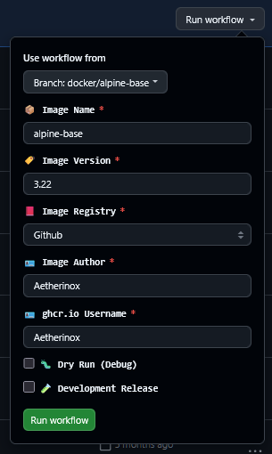

<h6>Docker Image using Ubuntu and s6-overlay</h6>
<h1>💿 Base Image - Ubuntu 💿</h1>

 

This branch `main` does not contain any files other than the `README.md`. You need to view the other branches for the Ubuntu image.

 
 

 
 

<!-- prettier-ignore-start -->
[![Version][dockerhub-version-img]][dockerhub-version-uri]
[![Dockerhub Pulls][dockerhub-pulls-img]][dockerhub-pulls-uri]
[![Github Pulls][github-pulls-img]][github-pulls-uri]
[![Size][github-size-img]][github-size-img]
[![Last Commit][github-commit-img]][github-commit-img]
[![Contributors][contribs-all-img]](#contributors-)
<!-- prettier-ignore-end -->

 

---

 

## About

The `main` branch of this repository does not contain any useful files. In order to access the alpine base image files; view the list of available repository branches below:

 

| Branch | Purpose |
| --- | --- | 
| [docker/ubuntu](https://github.com/aetherinox/docker-base-ubuntu/tree/docker/base-ubuntu) | Files required to generate your own Ubuntu base image which will be used for your own application. |
| [docker/core](https://github.com/aetherinox/docker-base-ubuntu/tree/docker/core) | Called internally by `docker/ubuntu` when Ubuntu base is created |
| [workflows/samples](https://github.com/aetherinox/docker-base-ubuntu/tree/workflows/samples) | Custom Github workflows will allow you to generate docker images and push to Dockerhub or Github |

 

---

 

## Workflow Usage

When executing the `deploy-docker-*.yml` workflows manually, you must select the branch `docker/base-ubuntu` from the top option **Use Workflow From**.

 

 <small><b>Github Workflow:</b> `docker-deploy-*.yml` - Workflow branch selection</small>

 

---

 

## Contributors ✨

We are always looking for contributors. If you feel that you can provide something useful to this project, then we'd love to review your suggestion. Before submitting your contribution, please review the following resources:

- [Pull Request Procedure](.github/PULL_REQUEST_TEMPLATE.md)
- [Contributor Policy](CONTRIBUTING.md)

 

Want to help but can't write code?

- Review [active questions by our community](https://github.com/aetherinox/docker-base-ubuntu/labels/help%20wanted) and answer the ones you know.

 

 

<!-- ALL-CONTRIBUTORS-BADGE:START - Do not remove or modify this section -->
[![Contributors][contribs-all-img]](#contributors-)
<!-- ALL-CONTRIBUTORS-BADGE:END -->

<!-- ALL-CONTRIBUTORS-LIST:START - Do not remove or modify this section -->
<!-- prettier-ignore-start -->
<!-- markdownlint-disable -->
<table>
  <tbody>
    <tr>
      <td align="center" valign="top" width="14.28%"><a href="https://gitlab.com/aetherinox"> <b>Aetherinox</b></a> <a href="https://github.com/aetherinox/badges/commits?author=aetherinox" title="Code">💻</a> <a href="#projectManagement-aetherinox" title="Project Management">📆</a> <a href="#fundingFinding-aetherinox" title="Funding Finding">🔍</a></td>
    </tr>
  </tbody>
</table>

<!-- markdownlint-restore -->
<!-- prettier-ignore-end -->
<!-- ALL-CONTRIBUTORS-LIST:END -->

 

---

 

<!-- BADGE > GENERAL -->
  [general-npmjs-uri]: https://npmjs.com
  [general-nodejs-uri]: https://nodejs.org
  [general-npmtrends-uri]: http://npmtrends.com/aetherinox

<!-- BADGE > VERSION > GITHUB -->
  [github-version-img]: https://img.shields.io/github/v/tag/aetherinox/docker-base-ubuntu?logo=GitHub&label=Version&color=ba5225
  [github-version-uri]: https://github.com/aetherinox/docker-base-ubuntu/releases

<!-- BADGE > VERSION > GITHUB (For the Badge) -->
  [github-version-ftb-img]: https://img.shields.io/github/v/tag/aetherinox/docker-base-ubuntu?style=for-the-badge&logo=github&logoColor=FFFFFF&logoSize=34&label=%20&color=ba5225
  [github-version-ftb-uri]: https://github.com/aetherinox/docker-base-ubuntu/releases

<!-- BADGE > VERSION > NPMJS -->
  [npm-version-img]: https://img.shields.io/npm/v/aetherinox?logo=npm&label=Version&color=ba5225
  [npm-version-uri]: https://npmjs.com/package/aetherinox

<!-- BADGE > VERSION > PYPI -->
  [pypi-version-img]: https://img.shields.io/pypi/v/aetherinox
  [pypi-version-uri]: https://pypi.org/project/aetherinox/

<!-- BADGE > LICENSE > MIT -->
  [license-mit-img]: https://img.shields.io/badge/MIT-FFF?logo=creativecommons&logoColor=FFFFFF&label=License&color=9d29a0
  [license-mit-uri]: https://github.com/aetherinox/docker-base-ubuntu/blob/main/LICENSE

<!-- BADGE > GITHUB > DOWNLOAD COUNT -->
  [github-downloads-img]: https://img.shields.io/github/downloads/aetherinox/docker-base-ubuntu/total?logo=github&logoColor=FFFFFF&label=Downloads&color=376892
  [github-downloads-uri]: https://github.com/aetherinox/docker-base-ubuntu/releases

<!-- BADGE > NPMJS > DOWNLOAD COUNT -->
  [npmjs-downloads-img]: https://img.shields.io/npm/dw/%40aetherinox%2Fdocker-base-ubuntu?logo=npm&&label=Downloads&color=376892
  [npmjs-downloads-uri]: https://npmjs.com/package/aetherinox

<!-- BADGE > GITHUB > DOWNLOAD SIZE -->
  [github-size-img]: https://img.shields.io/github/repo-size/aetherinox/docker-base-ubuntu?logo=github&label=Size&color=59702a
  [github-size-uri]: https://github.com/aetherinox/docker-base-ubuntu/releases

<!-- BADGE > NPMJS > DOWNLOAD SIZE -->
  [npmjs-size-img]: https://img.shields.io/npm/unpacked-size/aetherinox/latest?logo=npm&label=Size&color=59702a
  [npmjs-size-uri]: https://npmjs.com/package/aetherinox

<!-- BADGE > CODECOV > COVERAGE -->
  [codecov-coverage-img]: https://img.shields.io/codecov/c/github/aetherinox/docker-base-ubuntu?token=MPAVASGIOG&logo=codecov&logoColor=FFFFFF&label=Coverage&color=354b9e
  [codecov-coverage-uri]: https://codecov.io/github/aetherinox/docker-base-ubuntu

<!-- BADGE > ALL CONTRIBUTORS -->
  [contribs-all-img]: https://img.shields.io/github/all-contributors/aetherinox/docker-base-ubuntu?logo=contributorcovenant&color=de1f6f&label=contributors
  [contribs-all-uri]: https://github.com/all-contributors/all-contributors

<!-- BADGE > GITHUB > BUILD > NPM -->
  [github-build-img]: https://img.shields.io/github/actions/workflow/status/aetherinox/docker-base-ubuntu/deploy-docker-github.yml?logo=github&logoColor=FFFFFF&label=Build&color=%23278b30
  [github-build-uri]: https://github.com/aetherinox/docker-base-ubuntu/actions/workflows/deploy-docker-github.yml

<!-- BADGE > GITHUB > BUILD > Pypi -->
  [github-build-pypi-img]: https://img.shields.io/github/actions/workflow/status/aetherinox/docker-base-ubuntu/release-pypi.yml?logo=github&logoColor=FFFFFF&label=Build&color=%23278b30
  [github-build-pypi-uri]: https://github.com/aetherinox/docker-base-ubuntu/actions/workflows/pypi-release.yml

<!-- BADGE > GITHUB > TESTS -->
  [github-tests-img]: https://img.shields.io/github/actions/workflow/status/aetherinox/docker-base-ubuntu/docker-tests.yml?logo=github&label=Tests&color=2c6488
  [github-tests-uri]: https://github.com/aetherinox/docker-base-ubuntu/actions/workflows/docker-tests.yml

<!-- BADGE > GITHUB > COMMIT -->
  [github-commit-img]: https://img.shields.io/github/last-commit/aetherinox/docker-base-ubuntu?logo=conventionalcommits&logoColor=FFFFFF&label=Last%20Commit&color=313131
  [github-commit-uri]: https://github.com/aetherinox/docker-base-ubuntu/commits/main/

<!-- BADGE > DOCKER HUB > VERSION -->
  [dockerhub-version-img]: https://img.shields.io/docker/v/aetherinox/base-ubuntu/latest?logo=docker&logoColor=FFFFFF&label=Version&color=ba5225
  [dockerhub-version-uri]: https://hub.docker.com/repository/docker/aetherinox/base-ubuntu/general

<!-- BADGE > DOCKERHUB > PULLS -->
  [dockerhub-pulls-img]: https://img.shields.io/docker/pulls/aetherinox/base-ubuntu?logo=docker&logoColor=FFFFFF&label=Pulls&color=376892
  [dockerhub-pulls-uri]: https://hub.docker.com/repository/docker/aetherinox/base-ubuntu/general

<!-- BADGE > GITHUB > PULLS -->
  [github-pulls-img]: https://img.shields.io/badge/dynamic/json?url=https://ipitio.github.io/backage/aetherinox/docker-base-ubuntu/base-ubuntu.json&query=%24.downloads&logo=github&style=flat&color=376892&label=Pulls
  [github-pulls-uri]: https://github.com/aetherinox/docker-base-ubuntu/pkgs/container/base-ubuntu

